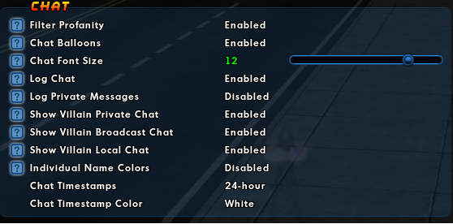
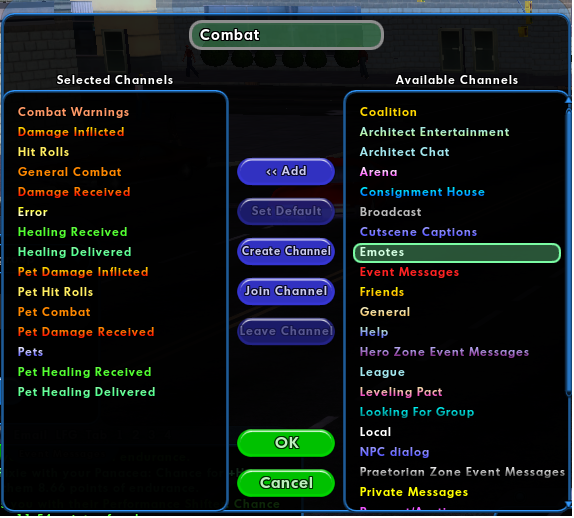

# ALPHA RELEASE - Cyclops - City of Heroes log parser
## I am open to suggestions for data you want to see. 

## Description
Application for parsing game chat logs into analysis reports.

## Preparation
Please, follow setup instructions otherwiase you will log incomplete or no data at all. You will have to this once for any character you want to parse.

Under Option->Windows->Chat, Set "Log Chat" to Enabled, hit, Apply Now.

In your chat Window, select the, Combat, tab, right click and edit.
Make sure these categories are in the left column:
- Combat Warnings
- Damage Inflicted
- Hit Rolls
- General Combat
- Damage Received
- Error
- Healing Received
- Healing Delivery
- Pet Damage Inflicted - Pet categories are very important or pseudo pet logging might be missed.
- Pet Hit Rolls
- Pet Damage Received
- Pets
- Pet Healing Received
- Pet Healing Delivery

At this point, I strongly suggest you log back to the character selection screen. It will make sure a clean session start occurs after all the changes.

Once, you log into a character, log files should start appearing in \<coh install dir\>/accounts/\<account name\>/Logs

## Cyclops instructions

For Windows users: You can use cyclops.bat to start the program.
Usage: cyclops.exe [OPTIONS]

  Options:  
  -l, --logdir \<Directories where your game chat files are stored. All files in the directory will be processed.\>  
  -f, --files \<List of game log files comma separated.\>  
  -i, --interval \<Time in seconds between combat sessions for DPS reports\>  
  -o, --outputdir \<Directory where you want the reports written. Defaults to "output"\>  
  -a, --address \<IP address the web server should use. Defaults to 127.0.0.1\>  
  -p, --port \<Port number the web server should use. Defaults to 11227\>  
  -h, --help Print help  
  -V, --version   

  Everything below is optional. The defeault behavior is to start the web server.
    Examples:  
      cyclops --logdir d:\coh\accounts\fake\Logs  
      cyclops --logdir='d:\coh\accounts\fake\Logs','d:\coh\accounts\fake2\Logs'
      cyclops --files d:\coh\accounts\fake\Logs\'chatlog 2024-02-10.txt'  
      cyclops --files='d:\coh\accounts\fake\Logs\'chatlog 2024-02-10.txt','cyclops --files d:\coh\accounts\fake\Logs\'chatlog 2024-02-10.txt'  
      cyclops --interval=42 --files d:\coh\accounts\fake\Logs\'chatlog 2024-02-10.txt'  
      cyclops --logdir d:\coh\accounts\fake\Logs --outputdir e:\putfileshere  
      cyclops --logdir d:\coh\accounts\fake\Logs --outputdir e:\putfileshere -a 192.111.222.1 -p 8080

## Web server

  After log processing the application will start a HTTP web server on http://127.0.0.1:11227 by default. Navigate to http://127.0.0.1:11227 to see an index page off all your processed log files. There will be four columns, date of the log file, player names that appear in the log, number of data points per summary, and the log file name. See below: Index.html

  Click on the date of the log to go to the details page. The summary page has each play session separated by tabs for the selected log file. See below: Summary.html

  When you are done using the tool. Press Control-C in the command window to terminate the application. I plan to make this more user friendly in the future.

## Report Directory

  If you want at the files directly look in the, Report Directory, printed during the application run. Default location is the "output" directory where you ran the application. Example: Report directory: "D:\\cyclops\\output\\beta.data.staff.ice.stalker.1.29.txt"  

## Report directory structure:  
    Directory name is designed to limit the chance of you overwriting log files when the chat file name is the same from different accounts.  
      \<player name\>\_\<log file date\>
      Example: night_pixie_2024_02_08

## Inside the report directory  
      Summary of the report session.   
        - summary.html - Contains all the sessions in a log file as tabs.
        - What is a session? Each time you log in or out. Or use /local START PARSE or /local END PARSE a new session is assumed.  
        - You can have multiple characters in the same log. Or multiple sessions of the same character.  
        - Copy of the source chat log. Example: chatlog_2024_02_08.txt  
        - dps.csv - Raw dps data using for the dps report in CSV format.  
        - parsed.txt - Log files parsed into internal format. Useful for finding missed log messages. Look for, Unparsed.
        - summary.db - An Sqlite version 3.2+ database of all the data currently collected. Everything is tied together by the summary_key field in the table, Summary.
      
### Index.html
      Default landing page of the web server. Default: http://127.0.0.1:11227
      - Lists all summaries in your "output" directory.
      - You can upload new logs for processing.
      - Actions:
        - Drop down will list any directory you have previous uploaded files.
        - Parse Directory - Parse every file in the select directory.
        - Parse Newest File In Directory - Parse the last file modified. Usually this is the last played session.
        - Text field is for copying the full path of the file or directory for uploading. You MUST provide the full path.
          - Use Control+Shift+C in the File Explorer to get the full path.
        Parse File - Parse a single file.
        Parse Directory - Parse all files in a directory. Afterwards, the directory will appear in the drop down list.

          

### Summary.html  
        - Attack Summary - Global totals for this session
        - Attack Summary By Power - Combat totals per power
          - Merge rows together that you think are related. Like procs.
          - Delete row
          - Remove Non Damage Power - Removes powers like Hasten, Placate, and Build Up.
          - Revert Changes - Revert all table changes.
        - DPS using an interval of \<interval\> - DPS (Damage per second) when the gap between damage log messages is less than the interval. Example, you attack a spawn, defeat them, wait 60 seconds, then attack another spawn. That would be considered two DPS sessions with an interval of 60.
        - Damage Dealt By Type - Damage done to mobs sorted by damage type.
        - Damage Taken By Type - Damage dealt to the player by damage type.
        - Damage Taken By Mob - General summary of damage dealt to the player by each mob.
        - Damage Taken By Mob Power - Detailed break down of damage dealt to the player by each mob's power.

### Notes
        - I round all numbers to the nearest whole number. Using rounding functions, not truncation. This does introduce small difference between the tool values and what you would get if you added the log values up manually. Around +/- 2%.
        - If you want to investigate the database directly. A good tool is https://www.sqlitestudio.pl/

